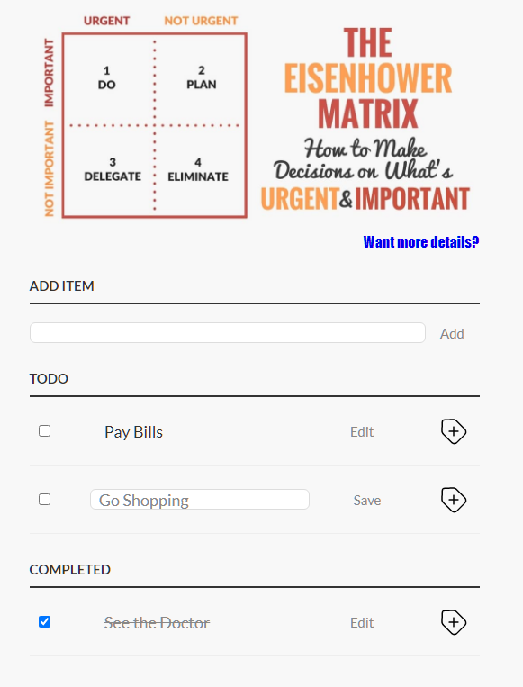

# Проект "TODO list"

[Смотреть на GitHub Pages ](https://mksfreelance.github.io/simple-todo-list/index.html)

#### запускать index.html

# Функционал приложения :

    - Добавление нового элемента в список задач "TODO"
    - Редактирование элемента в списке задач "TODO"
    - Удаление элемента из списка задач "TODO"
    - Установка элемента в статус завершенного и перенос в список "COMPLETED" через checkbox

    - Удаление элемента из списка "COMPLETED"
    - Редактирование элемента из списка "COMPLETED"
    - Установка элемента в статус незавершенного и перенос в список "TODO" через checkbox
    - Анимация на кнопке удаления
